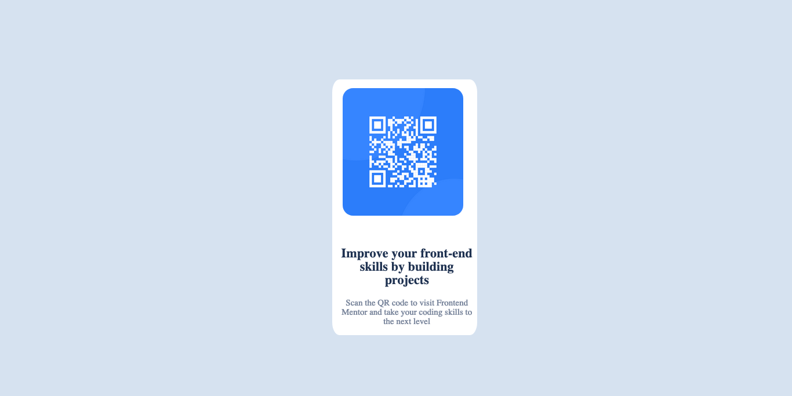

# Frontend Mentor - QR code component solution

This is a solution to the [QR code component challenge on Frontend Mentor](https://www.frontendmentor.io/challenges/qr-code-component-iux_sIO_H). Frontend Mentor challenges help you improve your coding skills by building realistic projects. 

## Table of contents

- [Overview](#overview)
  - [Screenshot](#screenshot)
- [My process](#my-process)
  - [Built with](#built-with)
  - [What I learned](#what-i-learned)
- [Author](#author)

## Overview

### Screenshot



## My process

### Built with

- Semantic HTML5 markup
- CSS custom properties
- Flexbox
- Mobile-first workflow

### What I learned
i learnt how to use border radius.

```html
 <h2>
  Improve your front-end skills by building projects
  </h2>
```
```css
 #item {
    background-color: white;
    width: 250px;
    margin-top: 20%;
    border-radius: 5%;
    margin-left: 30px;
  }
```
## Author

- Email - [Abdallah Aminu Daneji](waad2lf@gmail.com)
- Frontend Mentor - [@waad2lf](https://www.frontendmentor.io/profile/@waad2lf)
- Instagram - [waad2lfll](https://www.Instagram.com/waad2lfll)
